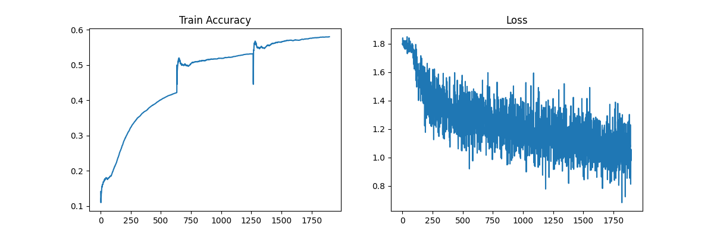

# bert-base-multilingual-uncased 모델

총 학습 시간
32G ram, 4090
8시간

```파일 형식
├─capstone
│  │  
│  ├─ datasets
│  │    train.csv
│  └─ test
│     └─ bert
│          test.py  
```

    python test.py

Accuracy, Loss 결과

